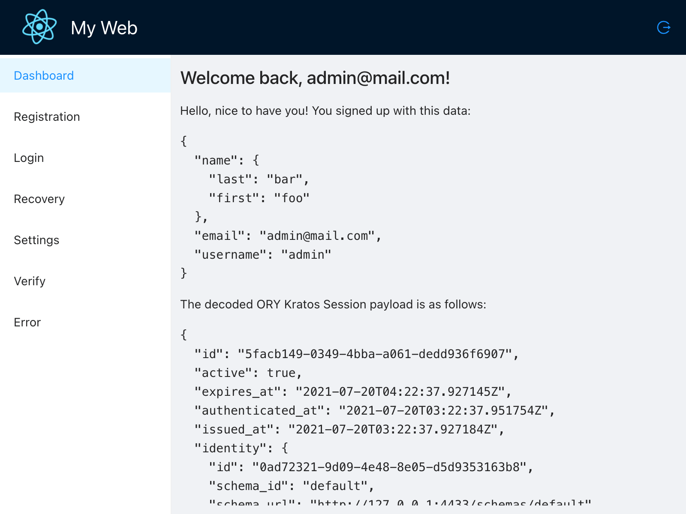

# Start Ory Kratos

[Ory Kratos](https://github.com/ory/kratos) [React](https://github.com/facebook/react) + [AntD](https://github.com/ant-design/ant-design) example.

## Prerequisites

- [Docker](https://docs.docker.com/engine/install/), [Docker Compose](https://docs.docker.com/compose/install/)
- [Node](https://github.com/nodejs/node), [Yarn](https://github.com/yarnpkg/yarn)

## Run Kratos Service

```bash
cd ory-kratos
docker-compose -f start.yml up --build --force-recreate
```

## Run React Web App

```bash
cd my-web
yarn start
```


